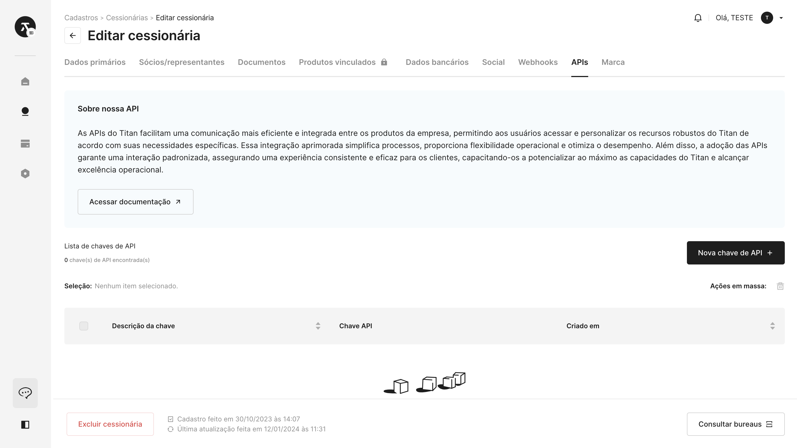
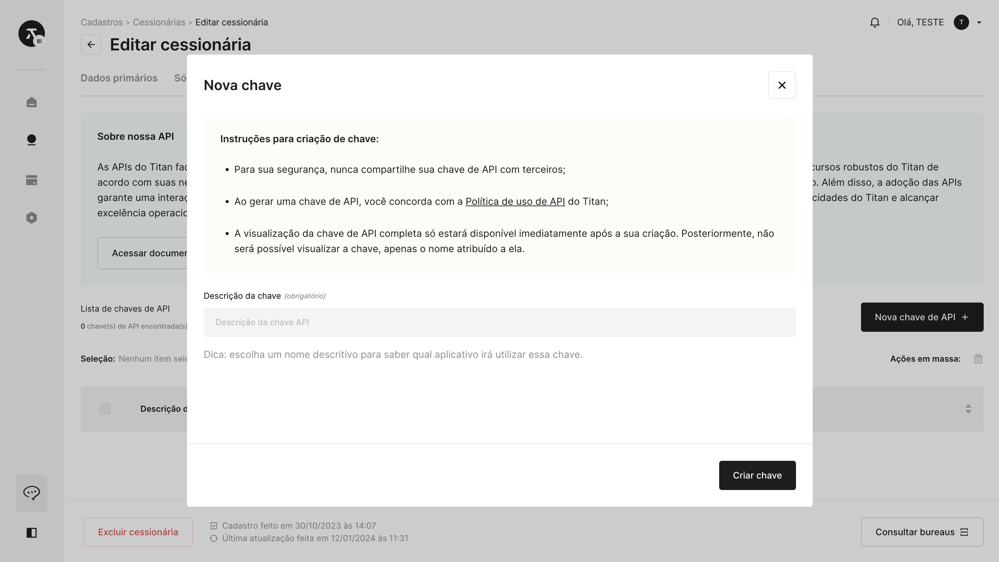
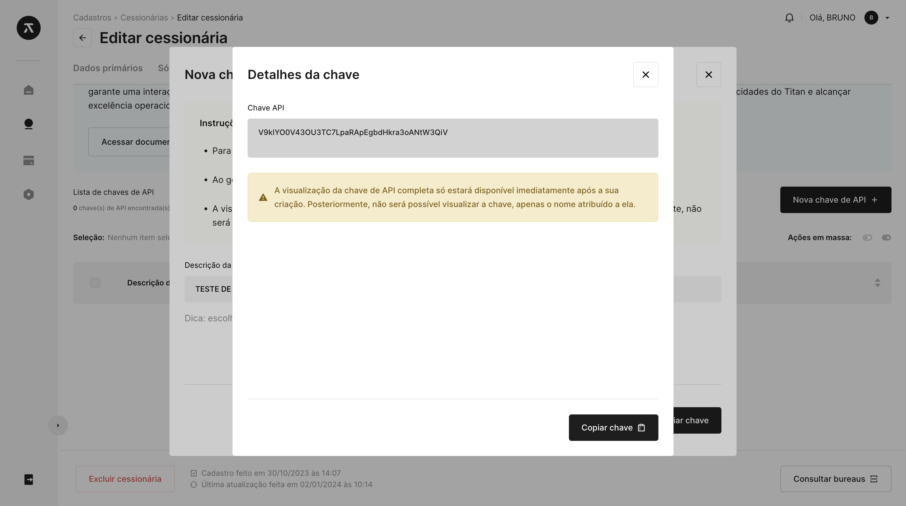
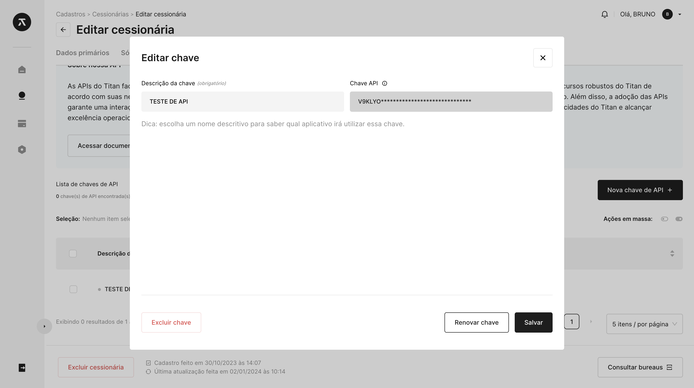
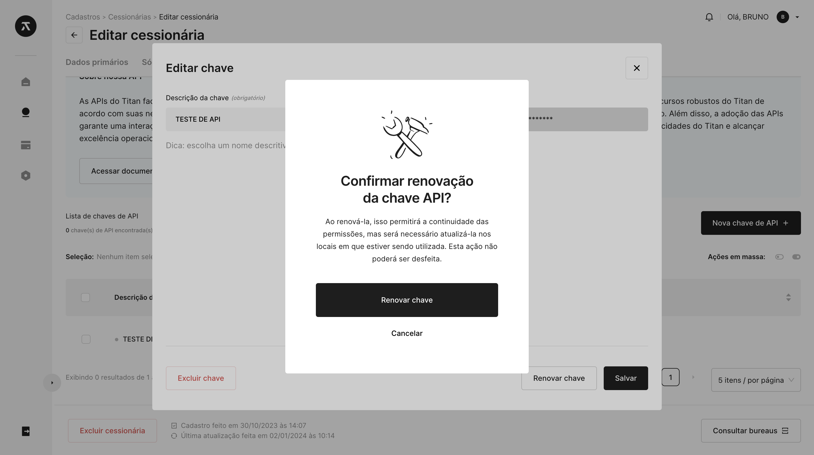

# 🔐 Autenticação

Esta seção da documentação é dedicada a orientá-lo no processo de autenticação no Titan CaaS. Garantimos que sua experiência seja suave e segura, permitindo que você se concentre no desenvolvimento de soluções financeiras inovadoras.

## Principais tópicos

- **Registro de aplicação:** Saiba como registrar seu aplicativo no Titan CaaS para obter credenciais de autenticação;
- **Autenticação de usuário:** Explore métodos seguros para autenticar usuários, garantindo a proteção das informações sensíveis durante o processo;
- **Autorização de acesso:** Entenda como conceder e gerenciar autorizações de acesso para garantir que apenas as partes autorizadas possam interagir com os recursos do Titan CaaS;
- **Fluxo de token de acesso:** Conheça o fluxo de obtenção e renovação de tokens de acesso para manter a segurança contínua durante a interação com a plataforma.

## Como gerar sua própria chave API

### Passo 1: Acesse o registro de uma cessionária

Vá para a seção de **"Cadastros"** e selecione **"Cessionárias"**. Em seguida, clique para **"Visualizar"** ou **"Editar"** a cessionária na qual você pretende gerar a chave.

### Passo 2: Navegue até a aba APIs

Dentro do registro da cessionária, dirija-se à aba **"APIs"** para administrar as chaves associadas a essa cessionária.

### Passo 3: Crie uma nova chave API

Pressione o botão **"Nova Chave de API"**. Será necessário fornecer uma descrição para a chave; recomendamos um nome descritivo para identificar qual aplicativo utilizará essa chave.

### Passo 4: Copie sua chave API

Após a geração bem-sucedida, uma nova chave API será exibida. Copie essa chave e guarde-a em um local seguro. Esta chave é única e será usada para autenticar suas solicitações ao sistema.

:::warning Fique atento!

A visualização completa da chave de API estará disponível **somente após a sua criação**. Ao sair dessa tela, não será possível visualizar a chave completa; será possível apenas visualizar o nome atribuído a ela ou renová-la, isso permitirá a continuidade das permissões, mas será necessário atualizá-la nos locais em que estiver sendo utilizada.

:::

 

**Agora você possui sua própria chave API!** Certifique-se de mantê-la em segredo e utilize-a conforme as políticas e práticas recomendadas.

## Como renovar uma chave API existente

### Passo 1: Comece editando sua chave

Para renovar uma chave API existente, clique para **"Editar"** a chave na qual você pretende renovar.

### Passo 2: Renovar chave

Depois disso, clique em **"Renovar chave"**. Um pop-up será exibido para que você confirme a renovação da chave. Após essa etapa, será possível visualizar a nova chave.

:::warning Lembre-se!

Atualize a chave antiga nas suas aplicações ou sistemas para garantir uma renovação sem perda de dados.

:::

 

Esperamos que este guia tenha sido útil. Se você tiver alguma dúvida ou encontrar problemas durante o processo, entre em contato com nossa equipe de suporte em *suporte@ceoslab.com.br*.