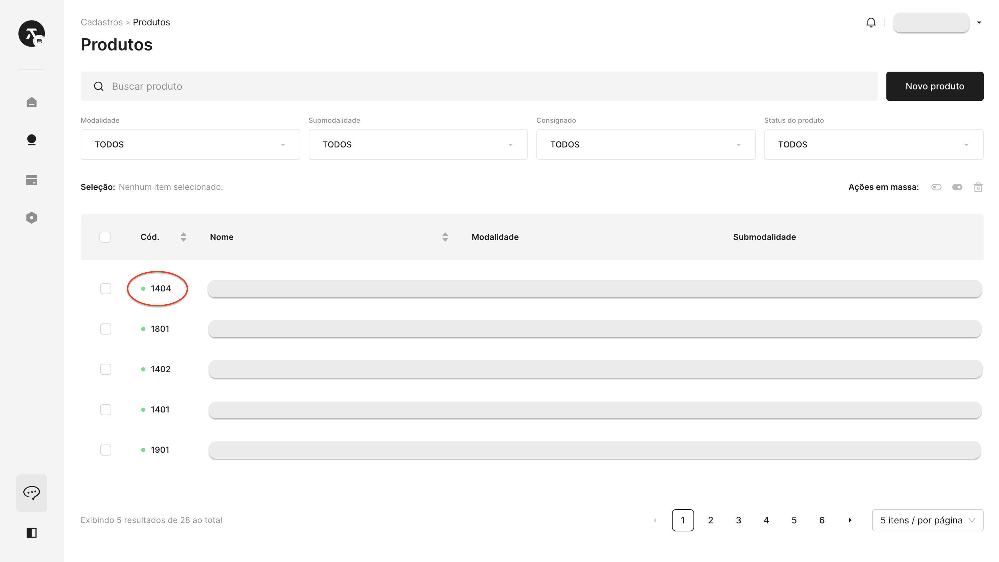

# 🚩 Criação

No contexto do Titan CaaS, a **criação de operação** representa o ponto de partida para a originação de solicitações de crédito, empréstimos e outras transações financeiras.

Essa funcionalidade permite que as instituições financeiras iniciem e personalizem cada operação de maneira singular, estabelecendo parâmetros específicos e requisitos detalhados para o processo em questão.

Ao utilizar a criação de operação, as organizações podem adaptar estrategicamente as operações às necessidades variáveis, garantindo uma análise de crédito precisa e eficiente. Esse recurso no Titan CaaS não apenas simplifica o início de novas operações de crédito, mas também proporciona flexibilidade crucial para ajustar dinamicamente as operações em resposta às mudanças no ambiente financeiro.

:::info Documentos

Para inclusão de documentos em uma operação, consulte a página [Documentos](/operacao/documentos).

:::

## Operação

Os atributos listados a seguir dizem respeito aos dados que precisarão ser fornecidos para a **criação de uma operação por meio da chave API**. Esteja atento à especificação dos objetos, distinguindo entre pessoa física e jurídica.

Para listar quais identificadores você precisará para realizar o envio da sua requisição, consulte a seção de [Mapeamento de campos](#mapeamento-de-campos).

### Parâmetros de envio

| Campo | Correspondência | Obrigatoriedade | Tipo de dado | Valor padrão |
| ----- | ----- | ----- | ----- | ----- |
| Data do aceite | ```acceptanceDate``` | Sim | Date | - |
| Data do primeiro vencimento | ```firstDueDate``` | Sim | Date | - |
| Quantidade de parcelas | ```installmentQuantity``` | Sim | Number | - |
| Valor solicitado | ```requestedValue``` | Sim | Number | - |
| Entrada | ```downPayment``` | Sim | Number | - |
| Financiar IOF | ```financeIOF``` | Sim |  Boolean | ```true``` |
| Financiar TFC | ```financeTFC``` | Sim | Boolean | ```true``` |
| Financiar seguro prestamista | ```financeCreditLifeInsurance``` | Sim | Boolean | ```true``` |
| Financiar seguro adicional | ```financeAdditionalInsurance``` | Sim | Boolean | ```true``` |
| Venda presencial | ```inPersonSale``` | Não | Boolean | ```false``` |
| Capitalização de taxa | ```growthType``` | Sim | ```EXPONENTIAL``` ou ```LINEAR``` | ```EXPONENTIAL``` |
| Descrição do bem | ```assetDescription``` | Não | String | - |
| [Identificador da frequência de pagamento](#frequência-de-pagamento-paymentfrequencyid) | ```paymentFrequencyID``` | Sim | Number | - |
| [Identificador do tipo de pagamento](#tipo-de-pagamento-paymenttypeid) | ```paymentTypeID``` | Sim | Number | - |
| [Identificador do produto](#produto-productid) | ```productID``` | Sim | Number | - |
| [Identificador do status da operação](#status-da-operação-operationstatusid) | ```operationStatusID``` | Sim | Number | - |
| Identificador da empresa | ```companyID``` | Sim | Number | - |
| [Tipo de empresa](#tipo-de-empresa-companytype) | ```companyType``` | Sim | String | ```MN``` |
| Cliente | ```customer``` | Sim | Objeto | - |
| Agente | ```agencyOffice``` | Não | - | ```null``` |
| Anexos do cliente | ```customerAttachments``` | Não | - | ```null``` |
| Avalistas | ```guarantors``` | Não | Array | - |
| Membros do comitê | ```committeeMembers``` | Não | Array | - |
| Garantias | ```collaterals``` | Não | Array | - |
| Pareceres | ```assessments``` | Não | Array | - |
| Desembolsos da operação | ```operationDisbursements``` | Não | Array | - |

### Exemplo de requisição

```bash showLineNumbers
{
	"acceptanceDate": "2024-01-21",
	"firstDueDate": "2024-02-20",
	"installmentQuantity": 24,
	"requestedValue": 20000.00,
	"downPayment": 0.00,
	"financeIOF": true,
	"financeTFC": true,
	"financeCreditLifeInsurance": true,
	"financeAdditionalInsurance": true,
	"inPersonSale": false,
	"growthType": "EXPONENTIAL",
	"assetDescription": null,
	"paymentFrequencyID": 51,
	"paymentTypeID": 1,
	"productID": 1403,
	"operationStatusID": 554,
	"companyID": 1551,
	"companyType": "MN",
	"customer": {
		...,
	}	
	"agencyOffice": null,
	"customerAttachments": null,
	"guarantors": [],
	"committeeMembers": [],
	"collaterals": [],
	"assessments": [],
	"operationDisbursements": []
}
```

---

## Cliente (Pessoa física)

Os seguintes campos pertencem ao objeto ```customer```, dando prioridade às peculiaridades de **pessoa física**. Para utilizar as especificações de [pessoa jurídica](#cliente-pessoa-jurídica), acesse o objeto correspondente.

Para listar quais identificadores você precisará para realizar o envio da sua requisição, consulte a seção de [Mapeamento de campos](#mapeamento-de-campos).

#### Parâmetros de envio

| Campo | Correspondência | Obrigatoriedade | Tipo de dado | Valor padrão |
| ----- | ----- | ----- | ----- | ----- |
| Tipo de cliente | ```customerType``` | Sim | ```PERSON``` ou ```COMPANY``` | ```PERSON``` |
| Pessoa | ```person``` | Sim | Objeto ou ```null``` | - |
| Empresa | ```company``` | Não | Objeto ou ```null``` | ```null``` |
| Contagem de operações | ```operationCount``` | Sim | Number | - |
| Contagem de operações de Avalista | ```guarantorOperationCount``` | Sim | Number | - |

#### Exemplo de requisição

:::warning Atenção!

Os campos abaixo são adicionados dentro do objeto ```customer```. Exemplo:

```bash showLineNumbers
"customer": {
    ...
}    
```

:::

```bash showLineNumbers
"customer": {
	"customerType": "PERSON",
	"person": {
		...,
	}	
	"company": null,
	"operationCount": 14,
	"guarantorOperationCount": 1
}
```

---

### ```PERSON```: Parâmetros de envio

Os seguintes campos pertencem ao objeto ```person```, dando prioridade às peculiaridades de **pessoa física**. Para utilizar as especificações de [pessoa jurídica](#cliente-pessoa-jurídica), acesse o objeto correspondente.

Para listar quais identificadores você precisará para realizar o envio da sua requisição, consulte a seção de [Mapeamento de campos](#mapeamento-de-campos).

| Campo | Correspondência | Obrigatoriedade | Tipo de dado | Valor padrão |
| ----- | ----- | ----- | ----- | ----- |
| E-mail | ```email``` | Sim | String | - |
| Nome completo | ```fullName``` | Sim | String | - |
| Nome para exibição | ```displayName``` | Não | String ou ```null``` | - |
| Número do documento (CPF) | ```documentNumber``` | Sim | String | - |
| Número do documento alternativo | ```documentNumberAlt``` | Não | String ou ```null``` | - |
| Órgão emissor do documento | ```documentIssuingBody``` | Não | String ou ```null``` | - |
| Número de telefone celular | ```mobilePhoneNumber``` | Não | String ou ```null``` | - |
| Número de telefone fixo | ```landlinePhoneNumber``` | Não | String ou ```null``` | - |
| Nome completo da mãe | ```mothersFullName``` | Não | String ou ```null``` | - |
| Nome completo do pai | ```fathersFullName``` | Não | String ou ```null``` | - |
| [Identificador da nacionalidade](#nacionalidade-país-nationalityid-countryid) | ```nationalityID``` | Não | Number ou ```null``` | - |
| [Identificador do Estado de nascimento](#nacionalidade-estado-identificador-do-estado-do-órgão-emissor-birthplacelevel1admindivid-ufid) | ```birthplaceLevel1AdminDivID``` | Não | Number ou ```null``` | - |
| [Identificador da Cidade de nascimento](#nacionalidade-cidade-birthplacelevel2admindivid) | ```birthplaceLevel2AdminDivID``` | Não | Number ou ```null``` | - |
| Data de nascimento | ```birthdate``` | Sim | Date | - |
| [Identificador do estado civil](#estado-civil-civilstatusid) | ```civilStatusID``` | Sim | Number | - |
| [Identificador da escolaridade](#escolaridade-educationlevelid) | ```educationLevelID``` | Não | Number ou ```null``` | - |
| [Identificador do sexo](#sexo-sexid) | ```sexID``` | Sim | Number | - |
| Patrimônio líquido | ```netWorth``` | Sim | Number | - |
| Renda comprovada | ```provenIncome``` | Não | Number ou ```null``` | - |
| Contas bancárias | ```accounts``` | Não | Objeto ou ```null``` | - |
| Links sociais | ```socialNetworks``` | Não | Objeto ou ```null``` | - |
| Documentos adicionais | ```additionalDocuments``` | Não | Objeto ou ```null``` | - |
| Ocupações | ```occupations``` | Não | Objeto ou ```null``` | - |
| [Endereço](#endereço-estado-level1admindivid-cidade-level2admindivid) | ```address``` | Não | Objeto ou ```null``` | - |
| Vinculo de empresas | ```linkedCompanies``` | Não | Objeto ou ```null``` | - |
| Autenticação | ```hasAuth``` | Não | Boolean | ```false``` |
| Identificador(es) dos anexos da pessoa | ```personAttachmentIDs``` | Não | Number | - |
| Identificador(es) das empresas vinculadas | ```linkedCompanyCompanyIDs``` | Não | Number | - |

### ```PERSON```: Exemplo de requisição

:::warning Atenção!

Os campos abaixo são adicionados dentro do objeto ```person```, que se encontram dentro do objeto ```customer```. Exemplo:

```bash showLineNumbers
"customer": {
	"person": {
		...
	}
}
```

:::

```bash showLineNumbers
"person": {
	"email": "pessoateste@gmail.com",
	"fullName": "PESSOA TESTE DA SILVA",
	"displayName": null,
	"documentNumber": "12345678900",
	"documentNumberAlt": null,
	"documentIssuingBody": null,
	"mobilePhoneNumber": "51999999999",
	"landlinePhoneNumber": null,
	"mothersFullName": null,
	"fathersFullName": null,
	"nationalityID": null,
	"birthplaceLevel1AdminDivID": null,
	"birthplaceLevel2AdminDivID": null,
	"birthdate": "1990-01-01",
	"civilStatusID": 2,
	"educationLevelID": null,
	"sexID": 1,
	"netWorth": 100000.00,
	"provenIncome": null,
	"accounts": [
		{
			...,
		}	
	]	
	"socialNetworks": [
		{
			...,
		}
	]		
	"additionalDocuments": [
		{
			...,
		}
	}		
	"occupations":[
		{
			...,
		}	
	]	
	"address": {
		...,
	}	
	"linkedCompanies": {
		...,
	}	
	"hasAuth": false,
	"personAttachmentIDs": [
		...
	],
	"linkedCompanyCompanyIDs": []
}
```

---

#### ```accounts```: Parâmetros de envio

Os seguintes campos pertencem ao objeto ```accounts```, dando prioridade às peculiaridades de **pessoa física**. Para utilizar as especificações de [pessoa jurídica](#cliente-pessoa-jurídica), acesse o objeto correspondente.

Para listar quais identificadores você precisará para realizar o envio da sua requisição, consulte a seção de [Mapeamento de campos](#mapeamento-de-campos).

| Campo | Correspondência | Obrigatoriedade | Tipo de dado | Valor padrão |
| ----- | ----- | ----- | ----- | ----- |
| Número da agência | ```agencyNumber``` | Sim | String | - |
| Número da conta | ```accountNumber``` | Sim | String | - |
| Dígito da conta | ```accountNumberDigit``` | Sim | String | - |
| [Identificador do tipo de conta](#tipo-de-conta-accounttypeid) | ```accountTypeID``` | Sim | Number | - |
| [Identificador do tipo de chave PIX da conta](#tipo-de-chave-pix-da-conta-accountpixkeytypeid) | ```accountPixKeyTypeID``` | Não | Number ou ```null``` | ```null``` |
| Chave Pix da conta | ```accountPixKey``` | Não | String ou ```null``` | ```null``` |
| [Identificador do banco](#banco-bankid) | ```bankID``` | Sim | Number | - |
| Conta primária | ```primaryAccount``` | Não | Boolean | ```false``` |
| Nome do titular | ```holderName``` | Sim | String | - |
| Número do documento (CPF) | ```documentNumber``` | Sim | String | - |

#### ```accounts```: Exemplo de requisição

:::warning Atenção!

Os campos abaixo são adicionados dentro do array de ```accounts```, que se encontram dentro do objeto ```person```. Exemplo:

```bash showLineNumbers
"person": {
	"accounts": [
		{
			...
		}
	]
}
```
:::

```bash showLineNumbers
"accounts": [
	{
		"agencyNumber": "0001",
		"accountNumber": "25191984",
		"accountNumberDigit": "9",
		"accountTypeID": 1,
		"accountPixKeyTypeID": null,
		"accountPixKey": null,
		"bankID": 560,
		"primaryAccount": false,
		"holderName": "PESSOA TESTE DA SILVA",
		"documentNumber": "12345678900"
	}
]
```

#### ```accounts```: Exemplo de resposta

```bash showLineNumbers
"accounts": [
	{
	"id": 1,
	"createdAt": "2022-03-10T12:15:50-04:00",
	"updatedAt": "2022-03-10T12:15:50-04:00",
	"createdByID": 1,
	"updatedByID": 1,
	"enabled": true,
	"agencyNumber": "0001",
	"accountNumber": "25191984",
	"accountNumberDigit": "9",
	"accountTypeID": 1,
	"accountPixKeyTypeID": null,
	"accountPixKey": null,
	"accountPixKeyTypeMask": null,
	"bankID": 560,
	"bank": {
		"id": 560,
		"createdAt": "2022-03-10T12:15:50-04:00",
		"updatedAt": "2022-03-10T12:15:50-04:00",
		"createdByID": null,
		"updatedByID": null,
		"enabled": true,
		"altCode": 18236120,
		"name": "NU PAGAMENTOS - IP",
		"code": 260,
		"fullName": "NU PAGAMENTOS S.A. - INSTITUIÇÃO DE PAGAMENTO"
	},
	"primaryAccount": false,
	"holderName": "PESSOA TESTE DA SILVA",
	"documentNumber": "12345678900",
	"personID": 325
	}
]
```

---

#### ```socialNetworks```: Parâmetros de envio

Os seguintes campos pertencem ao objeto ```socialNetworks```, dando prioridade às peculiaridades de **pessoa física**. Para utilizar as especificações de [pessoa jurídica](#cliente-pessoa-jurídica), acesse o objeto correspondente.

Para listar quais identificadores você precisará para realizar o envio da sua requisição, consulte a seção de [Mapeamento de campos](#mapeamento-de-campos) > [Tipo de link social](#tipo-de-link-social-social-network-types).

| Campo | Correspondência | Obrigatoriedade | Tipo de dado | Valor padrão |
| ----- | ----- | ----- | ----- | ----- |
| Identificador do tipo de link social | ```socialNetworkTypeID``` | Sim | Number | - |
| Endereço do link social | ```username``` | Sim | String | - |
| Identificador da pessoa | ```personID``` | Sim | Number | - |

#### ```socialNetworks```: Exemplo de requisição

:::warning Atenção!

Os campos abaixo são adicionados dentro do array de ```socialNetworks```, que se encontram dentro do objeto ```person```. Exemplo:

```bash showLineNumbers
"person": {
	"socialNetworks":[
		{
			...
		}
	]	
}
```
:::

```bash showLineNumbers
"socialNetworks": [
	{
		"socialNetworkTypeID": 51,
		"username": "pessoa.teste",
		"personID": 325
	}
]	
```

#### ```socialNetworks```: Exemplo de resposta

```bash showLineNumbers
"socialNetworks": [
	{
		"id": 1,
		"createdAt": "2022-03-10T12:15:50-04:00",
		"updatedAt": "2022-03-10T12:15:50-04:00",
		"createdByID": 1,
		"updatedByID": 1,
		"enabled": true,
		"socialNetworkTypeID": 51,
		"socialNetworkType": {
			"id": 51,
			"text": "Instagram",
			"enabled": true,
			"urlTemplate": "instagram.com"
		},
		"username": "pessoa.teste",
		"url": "instagram.com/pessoa.teste",
		"personID": 325
	}
]	
```

---

#### ```additionalDocuments```: Parâmetros de envio

Os seguintes campos pertencem ao objeto ```additionalDocuments```, dando prioridade às peculiaridades de **pessoa física**. Para utilizar as especificações de [pessoa jurídica](#cliente-pessoa-jurídica), acesse o objeto correspondente.

Para listar quais identificadores você precisará para realizar o envio da sua requisição, consulte a seção de [Mapeamento de campos](#mapeamento-de-campos) > [Tipo de documento adicional](#tipo-de-documento-adicional-typeid).

| Campo | Correspondência | Obrigatoriedade | Tipo de dado | Valor padrão |
| ----- | ----- | ----- | ----- | ----- |
| Número do documento | ```number``` | Sim | Number | - |
| Órgão emissor | ```authority``` | Não | String | - |
| Identificador do estado do órgão emissor | ```ufID``` | Não | Number | - |
| Identificador do tipo de documento | ```typeID``` | Não | Number | - |
| Data de emissão do documento | ```issueDate``` | Não | Date | - |

#### ```additionalDocuments```: Exemplo de requisição

:::warning Atenção!

Os campos abaixo são adicionados dentro do array de ```additionalDocuments```, que se encontram dentro do objeto ```person```. Exemplo:

```bash showLineNumbers
"person": {
	"additionalDocuments":[
		{
			...
		}
	]	
}
```
:::

```bash showLineNumbers
"additionalDocuments": [
	{
		"number": "1234567890",
		"authority": "ssp",
		"ufID": 23,
		"typeID": 3,
		"issueDate": "2019-08-09"
	}
]	
```

#### ```additionalDocuments```: Exemplo de resposta

```bash showLineNumbers
"additionalDocuments": [
	{
		"id": 1,
		"createdAt": "2022-03-10T12:15:50-04:00",
		"updatedAt": "2022-03-10T12:15:50-04:00",
		"createdByID": 1,
		"updatedByID": 1,
		"enabled": true,
		"number": "1234567890",
		"authority": "ssp",
		"ufID": 23,
		"uf": {
			"id": 23,
			"name": "Rio Grande do Sul",
			"countryID": 51,
			"abbreviation": "RS",
			"code": "43"
		},
		"typeID": 3,
		"type": {
			"id": 3,
			"text": "RG",
			"enabled": true
		},
		"issueDate": "2019-08-09",
		"personID": 325
	}
]	
```

---

#### ```occupations```: Parâmetros de envio

Os seguintes campos pertencem ao objeto ```occupations```, dando prioridade às peculiaridades de **pessoa física**. Para utilizar as especificações de [pessoa jurídica](#cliente-pessoa-jurídica), acesse o objeto correspondente.

| Campo | Correspondência | Obrigatoriedade | Tipo de dado | Valor padrão |
| ----- | ----- | ----- | ----- | ----- |
| Salário | ```salary``` | Sim | Number | - |
| Data de admissão | ```employmentStartDate``` | Sim | Date | - |
| Possui vínculo societário? | ```hasOwnershipLink``` | Sim | Boolean | - |
| Identificador da profissão | ```professionID``` | Sim | Number | - |
| Empresa | ```company``` | Sim | Objeto | - |
| Pessoa | ```person``` | Sim | Objeto | - |
| E-mail | ```email``` | Sim | String | - |
| Nome completo | ```fullName``` | Sim | String | - |
| Nome para exibição | ```displayName``` | Não | String ou ```null``` | - |
| Número do documento | ```documentNumber``` | Sim | String | - |
| Número do documento alternativo | ```documentNumberAlt``` | Não | String ou ```null``` | - |
| Órgão emissor do documento | ```documentIssuingBody``` | Não | String ou ```null``` | - |
| Número de telefone celular | ```mobilePhoneNumber``` | Não | String ou ```null``` | - |
| Número de telefone fixo | ```landlinePhoneNumber``` | Não | String ou ```null``` | - |
| Nome completo da mãe | ```mothersFullName``` | Não | String ou ```null``` | - |
| Nome completo do pai | ```fathersFullName``` | Não | String ou ```null``` | - |
| Identificador da nacionalidade | ```nationalityID``` | Não | Number ou ```null``` | - |
| Identificador do Estado de nascimento | ```birthplaceLevel1AdminDivID``` | Não | Number ou ```null``` | - |
| Identificador da Cidade de nascimento | ```birthplaceLevel2AdminDivID``` | Não | Number ou ```null``` | - |
| Data de nascimento | ```birthdate``` | Sim | Date | - |
| Identificador do estado civil | ```civilStatusID``` | Sim | Number | - |
| Identificador da escolaridade | ```educationLevelID``` | Não | Number ou ```null``` | - |
| Identificador do sexo | ```sexID``` | Sim | Number | - |
| Patrimônio líquido | ```netWorth``` | Sim | Number | - |
| Renda comprovada | ```provenIncome``` | Não | Number ou ```null``` | - |
| Autenticacão | ```hasAuth``` | Não | Boolean | ```null``` |

#### ```occupations```: Exemplo de requisição

:::warning Atenção!

Os campos abaixo são adicionados dentro do array de ```occupations```, que se encontram dentro do objeto ```person```. Exemplo:

```bash showLineNumbers
"customer": {
	"person": {
		"occupations": [
			{
				...
			}
		]
	}
}
```

:::

```bash showLineNumbers
"occupations": [
	{
		"salary": 100000.00,
		"employmentStartDate": "2000-10-10",
		"hasOwnershipLink": false,
		"professionID": 5,
		"company": {
			...
		},
		"person": {
			"email": "pessoateste@gmail.com",
			"fullName": "PESSOA TESTE DA SILVA",
			"displayName": null,
			"documentNumber": "12345678900",
			"documentNumberAlt": null,
			"documentIssuingBody": null,
			"mobilePhoneNumber": "51999999999",
			"landlinePhoneNumber": null,
			"mothersFullName": null,
			"fathersFullName": null,
			"nationalityID": null,
			"birthplaceLevel1AdminDivID": null,
			"birthplaceLevel2AdminDivID": null,
			"birthdate": "1990-01-01",
			"civilStatusID": 2,
			"educationLevelID": null,
			"sexID": 1,
			"netWorth": 100000.00,
			"provenIncome": null,
			"hasAuth": false
		},
		"businessPartner": null
	}
]
```

---

#### ```address```: Parâmetros de envio

Os seguintes campos pertencem ao objeto ```address```, dando prioridade às peculiaridades de **pessoa física**. Para utilizar as especificações de [pessoa jurídica](#cliente-pessoa-jurídica), acesse o objeto correspondente.

| Campo | Correspondência | Obrigatoriedade | Tipo de dado | Valor padrão |
| ----- | ----- | ----- | ----- | ----- |
| CEP | ```postalCode``` | Sim | String | - |
| Identificador do País | ```countryID``` | Sim | Number | ```51``` |
| Identificador do Estado | ```level1AdminDivID``` | Sim | Number | - |
| Identificador da Cidade | ```level2AdminDivID``` | Sim | Number | - |
| Endereço | ```line1``` | Sim | String | - |
| Número da residência | ```houseNumber``` | Sim | String | - |
| Complemento | ```line2``` | Não | String ou ```null``` | ```null``` |
| Bairro | ```neighborhood``` | Sim | String | - |
| Latitude | ```latitude``` | Não | Number ou ```null``` | ```null``` |
| Longitude | ```longitude``` | Não | Number ou ```null``` | ```null``` |

#### ```address```: Exemplo de requisição

:::warning Atenção!

Os campos abaixo são adicionados dentro do objeto ```address```, que se ecnontram dentro do objeto ```person```. Exemplo:

```bash showLineNumbers
"customer": {
	"person": {
		"address": {
			...
		}
	}
}    
```

:::

```bash showLineNumbers
"address": {
	"postalCode": "90450140",
	"countryID": 51,
	"level1AdminDivID": 23,
	"level2AdminDivID": 4932,
	"line1": "Rua Jaraguá",
	"houseNumber": "48",
	"line2": "333",
	"neighborhood": "Bela Vista",
	"latitude": null,
	"longitude": null
}
```

### Exemplo de resposta

```bash showLineNumbers
{
	"id": 5609,
	"createdAt": "2024-01-22T14:57:45.546353Z",
	"updatedAt": "2024-01-22T14:57:45.546357Z",
	"createdByID": 1,
	"updatedByID": 1,
	"enabled": true,
	"operationCode": 261,
	"workflowExecutionID": null,
	"acceptanceDate": "2024-01-22",
	"firstDueDate": "2024-02-20",
	"lastDueDate": null,
	"installmentQuantity": 24,
	"tfc": 800.00000000000000,
	"tfcPct": null,
	"monthlyInterestRate": 0.027800000000,
	"iofRate": 0.000082,
	"additionalIOFRate": 0.0038,
	"totalIOFValue": 599.622202721524588110835929597462528,
	"financedIOFValue": 617.0756101072917077074291111767207,
	"gracePeriod": 29,
	"monthlyTEC": 0.035897747292722041406600611574446,
	"yearlyTEC": 0.526872114623385581627779039644004,
	"disbursementAmount": 20000.00,
	"totalDisbursementAmount": 20000.00,
	"requestedValue": 20000.00,
	"totalValue": 30266.83,
	"downPayment": 0.00,
	"creditLifeInsurancePct": 0.020000000000,
	"creditLifeInsurance": 4E+2,
	"additionalInsuranceValue": 0,
	"financeIOF": true,
	"financeTFC": true,
	"financeCreditLifeInsurance": true,
	"financeAdditionalInsurance": false,
	"inPersonSale": false,
	"growthType": "EXPONENTIAL",
	"installmentFactor": 17.2997880164382247477682199284754290,
	"coefficient": 0.05780417650492606933983017590922908,
	"installmentValueWithoutIOF": 1225.45,
	"installmentValueWithIOF": 1261.1181,
	"financedValue": 21817.07561010729170770742911117672,
	"assetDescription": null,
	"paymentFrequencyID": 51,
	"paymentFrequency": null,
	"paymentTypeID": 1,
	"paymentType": null,
	"productVariantID": 1404,
	"productID": 1403,
	"customerID": 1505,
	"operationStatusID": 554,
	"operationStatus": null,
	"originatingCompanyID": 1551,
	"originatingCompanyType": "MN",
	"companyID": 1551,
	"companyType": "MN",
	"productVariant": null,
	"product": null,
	"customer": null,
	"agencyOffice": null,
	"customerAttachments": null,
	"guarantors": null,
	"committeeMembers": null,
	"collaterals": null,
	"assessments": null,
	"operationDisbursements": [],
	"installments": null,
	"operationSignatures": null,
	"operationMembers": null,
	"conversationID": null,
	"yearlyInterestRate": 0.3896433714367775113805455428461794,
	"operationAttachmentIDs": null
}
```

---

## Cliente (Pessoa jurídica)

Os seguintes campos pertencem ao objeto ```customer```, dando prioridade às peculiaridades de **pessoa jurídica**. Para utilizar as especificações de [pessoa física](#cliente-pessoa-física), acesse o objeto correspondente.

#### Parâmetros de envio

| Campo | Correspondência | Obrigatoriedade | Tipo de dado | Valor padrão |
| ----- | ----- | ----- | ----- | ----- |
| Tipo de cliente | ```customerType``` | Sim | ```PERSON``` ou ```COMPANY``` | ```COMPANY``` |
| Pessoa | ```person``` | Não | Objeto ou ```null``` | ```null``` |
| Empresa | ```company``` | Sim | Objeto ou ```null``` | - |
| Contagem de operações | ```operationCount``` | Sim | Number | - |
| Contagem de operações de Avalista | ```guarantorOperationCount``` | Sim | Number | - |

#### Exemplo de requisição

:::warning Atenção!

Os campos abaixo são adicionados dentro do objeto ```customer```. Exemplo:

```bash showLineNumbers
"customer": {
    ...
}    
```

:::

```bash showLineNumbers
"customer": {
	"customerType": "COMPANY",
	"person": null,
# highlight-start	
	"company": {
		...,
	}
# highlight-end		
	"operationCount": 14,
	"guarantorOperationCount": 1
}
```

---

### ```COMPANY```: Parâmetros de envio

| Campo | Correspondência | Obrigatoriedade | Tipo de dado | Valor padrão |
| ----- | ----- | ----- | ----- | ----- |

### ```COMPANY```: Exemplo de requisição

:::warning Atenção!

Os campos abaixo são adicionados dentro do objeto ```company```, que se encontram dentro do objeto ```customer```. Exemplo:

```bash showLineNumbers
"customer": {
	"company": {
		...
	}
}    
```

:::

```bash showLineNumbers
	[CÓDIGO]
```

### Exemplo de resposta

```bash showLineNumbers
	[CÓDIGO]
```

---

## Avalista(s)

:::info Inclusão de avalistas em uma operação

A inclusão de Avalistas em uma operação não é estritamente obrigatória; no entanto, se optar por incluí-los, é vital enviar alguns campos obrigatórios para garantir uma análise mais precisa.

:::

### Pessoa física

| Campo | Correspondência | Obrigatoriedade | Tipo de dado | Valor padrão |
| ----- | ----- | ----- | ----- | ----- |

### Pessoa jurídica

| Campo | Correspondência | Obrigatoriedade | Tipo de dado | Valor padrão |
| ----- | ----- | ----- | ----- | ----- |

---

## Garantia(s)

### Veículo

| Campo | Correspondência | Obrigatoriedade | Tipo de dado | Valor padrão |
| ----- | ----- | ----- | ----- | ----- |

<br />

:::info Tipo de bem

Para garantias de veículo, campo tipo de bem ```asset-type``` passar sempre o valor: *Veículo* obrigatoriamente.

:::

### Outras garantias

Os seguintes campos pertencem ao objeto ```collaterals```, para listar quais identificadores você precisará para realizar o envio da sua requisição, consulte a seção de [Mapeamento de campos](#mapeamento-de-campos).

### Imóvel

As garantias de imóvel estarão disponíveis em breve. ⏱️

---

## Mapeamento de campos

O processo de mapeamento de campos é essencial para compreender a relação entre os identificadores (IDs) utilizados nesta API e os campos específicos que cada ID representa. Nesta seção, apresentamos uma tabela abrangente que associa cada ID a uma descrição do respectivo campo correspondente. Essa abordagem visa simplificar a compreensão, fornecendo informações claras e significativas sobre a função de cada identificador no contexto da criação de uma operação dentro do Titan.

#### Produto (```productID```);

Peça ao seu parceiro de negócios que compartilhe o código do produto no painel dentro do Titan, a fim de incluir o identificador do produto em sua solicitação.



#### Frequência de pagamento (```paymentFrequencyID```):

| Identificador | Correspondência |
| ----- | ----- |
| 51 | Mensal |
| 52 | Trimestral |
| 53 | Semestral |

#### Tipo de pagamento (```paymentTypeID```):

| Identificador | Correspondência |
| ----- | ----- |
| 1 | Boleto |
| 2 | Débito em conta |

#### Tipo de documento adicional (```typeID```):

| Identificador | Correspondência |
| ----- | ----- |
| 1 | CNH |
| 2 | Passaporte |
| 3 | RG |

#### Status da operação (```operationStatusID```):

:::info Atente-se
Os status listados nesta API Rest variam de acordo com os status criados pela Organização.
:::

Padrão de API:

```js
GET {{ _.base_url }}/api/operation-statuses/list
```

Exemplo de requisição:

```js
GET https://{empresa}.titan.ceoslab.app/api/operation-statuses/list
```

Exemplo de resposta:

```bash showLineNumbers
[
	{
# highlight-next-line
		"id": 665,
		"createdAt": "2023-12-21T19:26:10.473238Z",
		"updatedAt": "2023-12-21T19:26:10.473243Z",
		"createdByID": null,
		"updatedByID": null,
		"enabled": true,
		"text": "Em análise",
		"code": "EM_ANALISE_ZXHDERO",
		"colorHex": "4573ec33",
		"operationCount": 3
	},
	{
# highlight-next-line		
		"id": 710,
		"createdAt": "2023-12-21T22:42:48.855745Z",
		"updatedAt": "2023-12-21T22:42:48.85575Z",
		"createdByID": null,
		"updatedByID": null,
		"enabled": true,
		"text": "PAGO",
		"code": "PAGO_HRPNNTP",
		"colorHex": "92cc8233",
		"operationCount": 0
	},
	...
]
```

#### Tipo de empresa (```companyType```):

| Identificador | Correspondência |
| ----- | ----- |
| MN | Organização |
| AO | Agente |
| AF | Conveniada |
| CB | Correspondente bancário |
| CS | Cessionária |

#### Endereço: Estado (```level1AdminDivID```), Cidade (```level2AdminDivID```):

:::info Atente-se
Esta API é utilizada para os casos em que é necessário fornecer o endereço completo.
:::

Padrão de API:

```js
GET {{ _.base_url }}/api/addresses/{cep}
```

Exemplo de requisição:

```js
GET https://{empresa}.titan.ceoslab.app/api/addresses/92025840
```

Exemplo de resposta:

```bash showLineNumbers
{
	"postalCode": "92025840",
	"countryID": 51,
	"country": {
		"id": 51,
		"text": "BRASIL",
		"enabled": true
	},
	"line1": "Avenida Açucena",
#highlight-start	
	"level1AdminDivID": 23,
	"level1AdminDiv": {
		"id": 23,
		"name": "Rio Grande do Sul",
		"countryID": 51,
		"abbreviation": "RS",
		"code": "43"
	},	
	"level2AdminDivID": 4686,
	"level2AdminDiv": {
		"id": 4686,
		"name": "CANOAS",
		"abbreviation": "RS",
		"code": "4304606",
		"level1AdminDivID": 23
	},
#highlight-end	
	"neighborhood": "Estância Velha",
	"latitude": -29.91714,
	"longitude": -51.15487
}		
```

#### Nacionalidade, País (```nationalityID```, ```countryID```):

| Identificador | Correspondência |
| ----- | ----- |
| 51 | Brasil |

#### Nacionalidade (Estado), Identificador do estado do órgão emissor (```birthplaceLevel1AdminDivID```, ```ufID```):

Padrão de API:

```js
GET {{ _.base_url }}/api/level-1-admin-divs/list
```

Exemplo de requisição:

```js
GET https://{empresa}.titan.ceoslab.app/api/level-1-admin-divs/list
```

Exemplo de resposta:

```bash showLineNumbers
[
	{
# highlight-next-line		
		"id": 23,
		"name": "Rio Grande do Sul",
		"countryID": 51,
		"abbreviation": "RS",
		"code": "43"
	},
	{
# highlight-next-line		
		"id": 19,
		"name": "Rio de Janeiro",
		"countryID": 51,
		"abbreviation": "RJ",
		"code": "33"
	},
	...
]
```

#### Nacionalidade (Cidade) (```birthplaceLevel2AdminDivID```):

Padrão de API:

```js
GET {{ _.base_url }}/api/level-2-admin-divs/list?filters[level1AdminDivID][$eq]={id}
```

Exemplo de requisição:

```js
GET https://{empresa}.titan.ceoslab.app/api/level-2-admin-divs/list?filters[level1AdminDivID][$eq]=23
```

Exemplo de resposta:

```bash showLineNumbers
[
	{
# highlight-next-line		
		"id": 4932,
		"name": "PORTO ALEGRE",
		"abbreviation": "RS",
		"code": "4314902",
		"level1AdminDivID": 23
	},
	{
# highlight-next-line		
		"id": 4789,
		"name": "GRAMADO",
		"abbreviation": "RS",
		"code": "4309100",
		"level1AdminDivID": 23
	},
	...
]
```

#### Estado civil (```civilStatusID```): 

| Identificador | Correspondência |
| ----- | ----- |
| 1 | Divorciado(a) |
| 2 | Casado(a) |
| 3 | Separado(a) |
| 4 | Solteiro(a) |
| 5 | Viúvo(a) |
| 51 | Casado com comunhão total de bens |
| 52 | Casado com comunhão parcial de bens |
| 53 | Casado com separação total de bens |
| 54 | União estável |

#### Escolaridade (```educationLevelID```):

| Identificador | Correspondência |
| ----- | ----- |
| 1 | Superior completo |
| 2 | Médio incompleto |
| 3 | Fundamental incompleto |
| 4 | Fundamental completo |
| 5 | Mestrado |
| 6 | Superior incompleto |
| 7 | Médio completo |
| 8 | Analfabeto |
| 9 | Doutorado |

#### Sexo (```sexID```):

| Identificador | Correspondência |
| ----- | ----- |
| 1 | Masculino |
| 2 | Prefiro não informar |
| 3 | Feminino |

#### Tipo de link social (```social-network-types```):

| Identificador | Correspondência |
| ----- | ----- |
| 51 | Instagram |
| 52 | LinkedIn empresarial |
| 53 | LinkedIn pessoal |
| 54 | Outro |
| 55 | Facebook |
| 56 | Site |
| 57 | Pinterest |
| 58 | X (Twitter) |

#### Tipo de conta (```accountTypeID```):

| Identificador | Correspondência |
| ----- | ----- |
| 1 | Conta corrente |
| 2 | Conta salário |
| 3 | Conta de depósitos |
| 4 | Conta poupança |
| 5 | Conta de pagamento |
| 6 | Conta universitária |

#### Tipo de chave PIX da conta (```accountPixKeyTypeID```):

| Identificador | Correspondência |
| ----- | ----- |
| 1 | Celular |
| 2 | E-mail |
| 3 | CNPJ |
| 4 | CPF |
| 5 | Chave aleatória |

#### Banco (```bankID```):

Padrão de API:

```js
GET {{ _.base_url }}/api/banks/list
```

Exemplo de requisição:

```js
GET https://{empresa}.titan.ceoslab.app/api/banks/list
```

Exemplo de resposta:

```bash showLineNumbers
[
	{
# highlight-next-line
		"id": 401,
		"createdAt": "2023-10-09T12:41:37.243219Z",
		"updatedAt": "2023-10-09T12:41:37.243225Z",
		"createdByID": null,
		"updatedByID": null,
		"enabled": true,
		"altCode": 0,
		"name": "BCO DO BRASIL S.A.",
		"code": 1,
		"fullName": "Banco do Brasil S.A."
	},
	{
# highlight-next-line		
		"id": 410,
		"createdAt": "2023-10-09T12:41:37.251317Z",
		"updatedAt": "2023-10-09T12:41:37.251321Z",
		"createdByID": null,
		"updatedByID": null,
		"enabled": true,
		"altCode": 360305,
		"name": "CAIXA ECONOMICA FEDERAL",
		"code": 104,
		"fullName": "CAIXA ECONOMICA FEDERAL"
	},
	...
]
```

#### Profissão (```professionID```):

Padrão de API:

```js
GET {{ _.base_url }}/api/professions/list
```

Exemplo de requisição:

```js
GET https://{empresa}.titan.ceoslab.app/api/professions/list
```

Exemplo de resposta:

```bash showLineNumbers
[
	{
# highlight-next-line		
		"id": 538,
		"text": "REITOR",
		"enabled": true
	},
	{
# highlight-next-line		
		"id": 318,
		"text": "ELETRICISTA",
		"enabled": true
	},
	{
# highlight-next-line		
		"id": 107,
		"text": "BIBLIOTECÁRIO",
		"enabled": true
	},
	...
]	
```

#### Tipo de outras garantias (```asset-types```):

| Identificador | Correspondência |
| ----- | ----- |
| 151 | Celular/Eletrônicos |
| 152 | Demais máquinas |
| 153 | Equipamentos agrícolas |
| 154 | Equipamentos alimentícios |
| 155 | Equipamentos de som |
| 156 | Equipamentos estéticos |
| 157 | Equipamentos médicos |
| 158 | Equipamentos odontológicos |
| 159 | Equipamentos para academia |
| 160 | Equipamentos veterinários |
| 161 | Impressoras/Equipamentos gráficos |
| 162 | Instrumentos musicais |
| 163 | Máquinas CNC |
| 164 | Materiais para veículos |
| 165 | Móveis planejados |
| 166 | Outro |
| 167 | Veículos |
| 168 | Imóveis |

### Garantias de veículo

Nossa API para o envio de informações de veículos em garantia adere estritamente à [**tabela Fipe**](https://veiculos.fipe.org.br/). Portanto, por favor, siga esta sequência de ordenação para extrair os dados com precisão e formate sua requisição adequadamente.

#### 1 - Tipo de veículo (```vehicle-types```):

Padrão de API:

```js
GET {{ _.base_url }}/api/fipe/vehicle-types
```

Exemplo de requisição:

```js
GET https://{empresa}.titan.ceoslab.app/api/fipe/vehicle-types
```

Exemplo de resposta:

```bash showLineNumbers
[
	{
# highlight-next-line		
		"code": 1,
		"text": "CAR"
	},
	{
# highlight-next-line		
		"code": 2,
		"text": "MOTORCYCLE"
	},
	{
# highlight-next-line		
		"code": 3,
		"text": "TRUCK"
	}
]	
```

#### 2 - Marca do veículo (```brands```):

Padrão de API:

```js
GET {{ _.base_url }}/api/fipe/vehicle-types/{vehicleTypeCode}/brands
```

Exemplo de requisição:

```js
GET https://{empresa}.titan.ceoslab.app/api/fipe/vehicle-types/1/brands
```

Exemplo de resposta:

```bash showLineNumbers
[
	{
		"id": 415,
		"text": "Mercedes-Benz",
		"enabled": true,
# highlight-next-line		
		"fipeBrandCode": 39,
		"fipeVehicleType": "CAR",
		"fipeReferenceTableCode": 305,
		"fipeReferenceTable": {
			"id": 1,
			"createdAt": "2023-12-21T13:55:46.910126Z",
			"updatedAt": "2024-01-02T15:03:34.833771Z",
			"createdByID": null,
			"updatedByID": null,
			"enabled": true,
			"referenceTable": 305,
			"yearMonth": "2024-01"
		}
	},
	...
]
```

#### 3 - Modelo do veículo (```models```):

Padrão de API:

```js
GET {{ _.base_url }}/api/fipe/vehicle-types/{vehicleTypeCode}/brands/{brandCode}/models
```

Exemplo de requisição:

```js
GET https://{empresa}.titan.ceoslab.app/api/fipe/vehicle-types/1/brands/39/models
```

Exemplo de resposta:

```bash showLineNumbers
[
	{
		"id": 1073,
		"text": "C-250 CGI Sport 1.8 16V Aut.",
		"enabled": true,
# highlight-next-line		
		"fipeModelCode": 5500,
		"fipeBrandCode": 39,
		"fipeReferenceTableCode": 305,
		"fipeBrand": {
			"id": 415,
			"text": "Mercedes-Benz",
			"enabled": true,
			"fipeBrandCode": 39,
			"fipeVehicleType": "CAR",
			"fipeReferenceTableCode": 305,
			"fipeReferenceTable": {
			"id": 1,
			"createdAt": "2023-12-21T13:55:46.910126Z",
			"updatedAt": "2024-01-02T15:03:34.833771Z",
			"createdByID": null,
			"updatedByID": null,
			"enabled": true,
			"referenceTable": 305,
			"yearMonth": "2024-01"
			}
		},
		"fipeReferenceTable": {
			"id": 1,
			"createdAt": "2023-12-21T13:55:46.910126Z",
			"updatedAt": "2024-01-02T15:03:34.833771Z",
			"createdByID": null,
			"updatedByID": null,
			"enabled": true,
			"referenceTable": 305,
			"yearMonth": "2024-01"
		},
		"fipeVehicleType": "CAR"
	},
	...
]
```

#### 4 - Ano do modelo do veículo (```years```):

Padrão de API:

```js
GET {{ _.base_url }}/api/fipe/vehicle-types/{vehicleTypeCode}/brands/{brandCode}/models/{modelCode}/years
```

Exemplo de requisição:

```js
GET https://{empresa}.titan.ceoslab.app/api/fipe/vehicle-types/1/brands/39/models/5500/years
```

Exemplo de resposta:

```bash showLineNumbers
[
	{
		"id": 1001,
		"text": "2014 Gasolina",
		"enabled": true,
# highlight-next-line
		"fipeModelYear": 2014,
# highlight-next-line		
		"fipeFuelType": 1,
		"fipeModelCode": 5500,
		"fipeBrandCode": 39,
		"fipeReferenceTableCode": 305,
		"fipeBrand": {
			"id": 415,
			"text": "Mercedes-Benz",
			"enabled": true,
			"fipeBrandCode": 39,
			"fipeVehicleType": "CAR",
			"fipeReferenceTableCode": 305,
			"fipeReferenceTable": {
			"id": 1,
			"createdAt": "2023-12-21T13:55:46.910126Z",
			"updatedAt": "2024-01-02T15:03:34.833771Z",
			"createdByID": null,
			"updatedByID": null,
			"enabled": true,
			"referenceTable": 305,
			"yearMonth": "2024-01"
			}
		},
		"fipeModel": {
			"id": 1073,
			"text": "C-250 CGI Sport 1.8 16V Aut.",
			"enabled": true,
			"fipeModelCode": 5500,
			"fipeBrandCode": 39,
			"fipeReferenceTableCode": 305,
			"fipeBrand": {
			"id": 415,
			"text": "Mercedes-Benz",
			"enabled": true,
			"fipeBrandCode": 39,
			"fipeVehicleType": "CAR",
			"fipeReferenceTableCode": 305,
			"fipeReferenceTable": {
				"id": 1,
				"createdAt": "2023-12-21T13:55:46.910126Z",
				"updatedAt": "2024-01-02T15:03:34.833771Z",
				"createdByID": null,
				"updatedByID": null,
				"enabled": true,
				"referenceTable": 305,
				"yearMonth": "2024-01"
			}
			},
			"fipeReferenceTable": {
			"id": 1,
			"createdAt": "2023-12-21T13:55:46.910126Z",
			"updatedAt": "2024-01-02T15:03:34.833771Z",
			"createdByID": null,
			"updatedByID": null,
			"enabled": true,
			"referenceTable": 305,
			"yearMonth": "2024-01"
			},
			"fipeVehicleType": "CAR"
		},
		"fipeReferenceTable": null,
		"fipeVehicleType": "CAR"
	},
	...
]
```

#### 5 - Tipo de combustível do veículo (```fuel-types```):

Padrão de API:

```js
GET {{ _.base_url }}/api/fipe/vehicle-types/{vehicleTypeCode}/brands/{brandCode}/models/{modelCode}/years/{year}/fuel-types/{fuelTypeCode}
```

Exemplo de requisição:

```js
GET https://{empresa}.titan.ceoslab.app/api/fipe/vehicle-types/1/brands/39/models/5500/years/2014/fuel-types/1
```

Exemplo de resposta:

```bash showLineNumbers
{
	"Valor": "R$ 102.306,00",
	"Marca": "Mercedes-Benz",
	"Modelo": "C-250 CGI Sport 1.8 16V Aut.",
	"AnoModelo": 2014,
	"Combustivel": "Gasolina",
	"CodigoFipe": "021242-3",
	"MesReferencia": "janeiro de 2024 ",
	"Autenticacao": "f58vkjmrzpcsv",
	"TipoVeiculo": 1,
	"SiglaCombustivel": "G",
	"DataConsulta": "quarta-feira, 31 de janeiro de 2024 11:39"
}
```