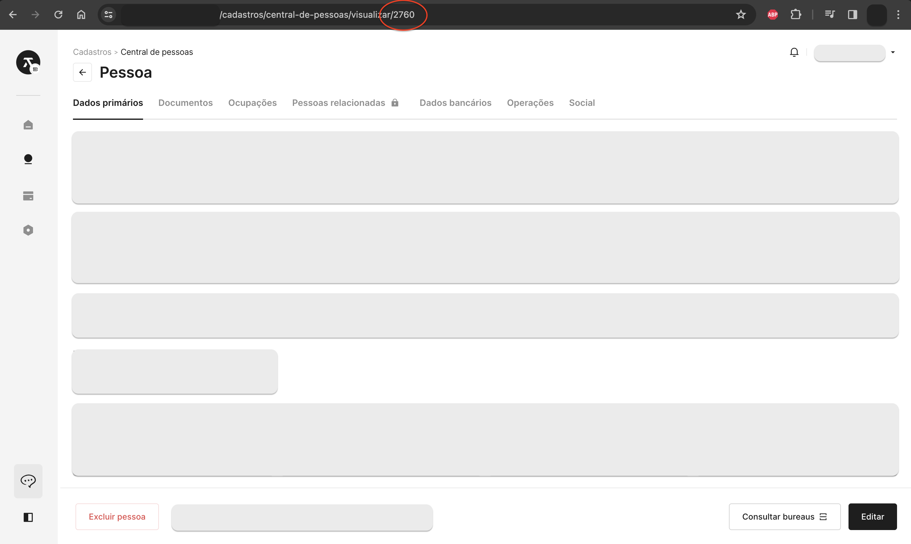
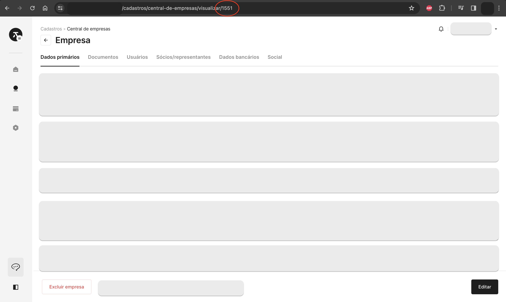
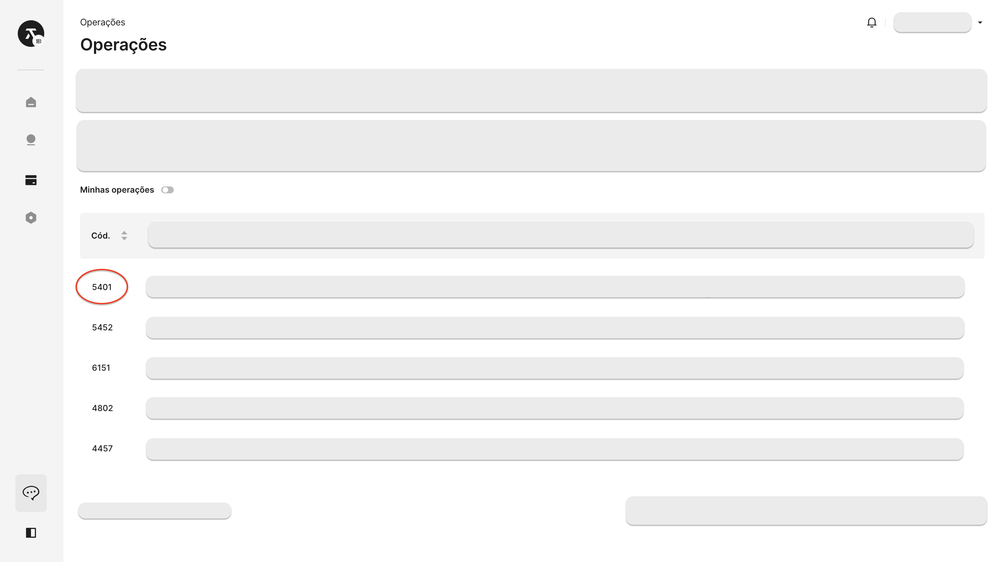

# 📂 Documentos

Dentro da estrutura do Titan CaaS, a inclusão de documentos em uma operação desempenha um papel fundamental na robustez e transparência do processo de originação de solicitações de crédito, empréstimos e transações financeiras correlatas. Essa funcionalidade permite que as instituições financeiras enriqueçam e detalhem cada operação ao incorporar documentos informativos relevantes.

Ao fazer isso, a plataforma facilita uma compreensão abrangente das circunstâncias e necessidades associadas a cada operação. Ao oferecer essa capacidade de inclusão de documentos, o Titan CaaS capacita as instituições a aprimorar a análise de crédito, ao mesmo tempo em que promove a eficiência operacional e a clareza no processo de tomada de decisão.

Essa abordagem contribui para a criação de uma base sólida e confiável para a condução de operações financeiras, garantindo a documentação adequada e promovendo a confiança tanto para as instituições quanto para os clientes envolvidos.

## Passo 1: Envio e vinculo do arquivo a um cliente, avalista ou garantia

Antes de vincular a documentação em uma operação, é necessário carregar o arquivo a um cliente, avalista (seja pessoa física ou jurídica) ou garantia. Após concluído conforme as instruções abaixo, os demais vínculos são estabelecidos.

### Pessoa física

#### Parâmetros de envio

| Atributo | Correspondência | Obrigatoriedade | Tipo de dado | Valor padrão |
| ----- | ----- | ----- | ----- | ----- |
| Arquivo | ```file``` | Sim | Binary | - |
| [Identificador da categoria do arquivo](#categoria-do-arquivo-attachmenttypeid) | ```attachmentTypeID``` | Sim | Number | - |
| Data de vencimento | ```dueDate``` | Não | Date | - |
| Visibilidade na esteira de crédito | ```visible``` | Sim | Boolean | - |
| [Identificador da pessoa](#pessoa-personid) | ```personID``` | Sim | Number | - |

#### Padrão de API:

```js
POST {{ _.base_url }}/api/person-attachments/{personID}/upload
```

#### Exemplo de rota:

```js
POST https://{empresa}.titan.ceoslab.app/api/person-attachments/2760/upload
```

##### ```Header```:

```bash showLineNumbers
{
    "Content-Type": "multipart/form-data;",
    "Titan-Api-Key": "{Sua chave API}"
}
```

##### ```Body```:

```bash showLineNumbers
{
    "file": "FILE(form-data)",
    "attachmentTypeID": 51,
    "dueDate": "2025-01-01",
    "visible": true
}
```

#### Exemplo de resposta

```bash showLineNumbers
{
# highlight-next-line
    "id": 7558,
    "createdAt": "2024-02-21T16:35:15.636778Z",
    "updatedAt": "2024-02-21T16:35:15.636781Z",
    "createdByID": 2760,
    "updatedByID": 2760,
    "enabled": true,
    "dueDate": "2025-01-01",
    "uid": "1708533315-8fb31656-7b91-42b8-93b4-48e869251f83",
    "filename": "imagem-pessoa-teste.jpeg",
    "size": 262009,
    "mimeType": "image/jpeg",
    "attachmentTypeID": 51,
    "attachmentType": null,
    "visible": true,
    "sha256sum": "ee8d0b3fe537830ae4665824fb35d11944d7a937ecc0d5b16a3d2d4b8c0765f8"
}
```

### Pessoa jurídica

#### Parâmetros de envio

| Atributo | Correspondência | Obrigatoriedade | Tipo de dado | Valor padrão |
| ----- | ----- | ----- | ----- | ----- |
| Arquivo | ```file``` | Sim | Binary | - |
| [Identificador da categoria do arquivo](#categoria-do-arquivo-attachmenttypeid) | ```attachmentTypeID``` | Sim | Number | - |
| Data de vencimento | ```dueDate``` | Não | Date | - |
| Visibilidade na esteira de crédito | ```visible``` | Sim | Boolean | - |
| [Identificador da empresa](#empresa-companyid) | ```companyID``` | Sim | Number | - |

#### Padrão de API:

```js
POST {{ _.base_url }}/api/company-attachments/{companyID}/upload
```

#### Exemplo de rota:

```js
POST https://{empresa}.titan.ceoslab.app/api/company-attachments/1551/upload
```

##### ```Header```:

```bash showLineNumbers
{
    "Content-Type": "multipart/form-data;",
    "Titan-Api-Key": "{Sua chave API}"
}
```

##### ```Body```:

```bash showLineNumbers
{
    "file": "FILE(form-data)",
    "attachmentTypeID": 51,
    "dueDate": "2025-01-01",
    "visible": true
}
```

#### Exemplo de resposta

```bash showLineNumbers
{
# highlight-next-line
    "id": 7562,
    "createdAt": "2024-02-22T16:35:15.636778Z",
    "updatedAt": "2024-02-22T16:35:15.636781Z",
    "createdByID": 2760,
    "updatedByID": 2760,
    "enabled": true,
    "dueDate": "2025-01-01",
    "uid": "5608533315-8fb31656-7b91-42b8-93b4-48e869251f83",
    "filename": "imagem-empresa-teste.jpeg",
    "size": 647284,
    "mimeType": "image/jpeg",
    "attachmentTypeID": 51,
    "attachmentType": null,
    "visible": true,
    "sha256sum": "io8d0b3fe537830ae4665824fb35d11944d7a937ecc0d5b16a3d2d4b8c0765f8"
}
```

### Garantia

#### Parâmetros de envio

| Atributo | Correspondência | Obrigatoriedade | Tipo de dado | Valor padrão |
| ----- | ----- | ----- | ----- | ----- |
| Arquivo | ```file``` | Sim | Binary | - |
| [Identificador da categoria do arquivo](#categoria-do-arquivo-attachmenttypeid) | ```attachmentTypeID``` | Sim | Number | - |
| Data de vencimento | ```dueDate``` | Não | Date | - |
| Visibilidade na esteira de crédito | ```visible``` | Sim | Boolean | - |
| [Identificador da garantia](#garantia-collateralid) | ```collateralID``` | Sim | Number | - |

#### Padrão de API:

```js
POST {{ _.base_url }}/api/collateral-attachments/{collateralID}/upload
```

#### Exemplo de rota:

```js
POST https://{empresa}.titan.ceoslab.app/api/collateral-attachments/1298/upload
```

##### ```Header```:

```bash showLineNumbers
{
    "Content-Type": "multipart/form-data;",
    "Titan-Api-Key": "{Sua chave API}"
}
```

##### ```Body```:

```bash showLineNumbers
{
    "file": "FILE(form-data)",
    "attachmentTypeID": 51,
    "dueDate": "2025-01-01",
    "visible": true
}
```

#### Exemplo de resposta

```bash showLineNumbers
{
# highlight-next-line
    "id": 7674,
    "createdAt": "2024-02-23T16:35:15.636778Z",
    "updatedAt": "2024-02-23T16:35:15.636781Z",
    "createdByID": 2760,
    "updatedByID": 2760,
    "enabled": true,
    "dueDate": "2025-01-01",
    "uid": "7108533315-8fb31656-7b91-42b8-93b4-48e869251f83",
    "filename": "imagem-garantia-teste.jpeg",
    "size": 206017,
    "mimeType": "image/jpeg",
    "attachmentTypeID": 51,
    "attachmentType": null,
    "visible": true,
    "sha256sum": "fg8d0b3fe537830ae4665824fb35d11944d7a937ecc0d5b16a3d2d4b8c0765f8"
}
```

## Passo 2: Vinculo do documento com uma operação

Depois de enviar e vincular o documento às entidades mencionadas anteriormente, utilizando o ```id``` gerado na resposta da API, você será capaz de associar a documentação à sua operação.

### Pessoa física

#### Parâmetros de envio

| Atributo | Correspondência | Obrigatoriedade | Tipo de dado | Valor padrão |
| ----- | ----- | ----- | ----- | ----- |
| Identificador do documento | ```attachmentID``` | Sim | Number | - |
| [Identificador da operação](#operação-operationid) | ```operationID``` | Sim | Number | - |
| [Identificador da pessoa](#pessoa-personid) | ```personID``` | Sim | Number | - |

#### Padrão de API:

```js
POST {{ _.base_url }}/api/operations-attachments
```

#### Exemplo de rota:

```js
POST https://{empresa}.titan.ceoslab.app/api/operations-attachments
```

#### Exemplo de requisição:

```bash showLineNumbers
{
    "attachmentID": 7558,
    "operationID": 5401,
    "personID": 2760
}
```

#### Exemplo de resposta:

```bash showLineNumbers
{
    "id": 1604,
    "createdAt": null,
    "updatedAt": null,
    "createdByID": 2760,
    "updatedByID": 2760,
    "enabled": true,
    "attachmentID": 7558,
    "attachment": null,
    "visible": null,
    "operationID": 5401,
    "companyID": null,
    "company": null,
    "personID": 2760,
    "person": null,
    "collateralID": null,
    "collateral": null
}
```

### Pessoa jurídica

#### Parâmetros de envio

| Atributo | Correspondência | Obrigatoriedade | Tipo de dado | Valor padrão |
| ----- | ----- | ----- | ----- | ----- |
| Identificador do documento | ```attachmentID``` | Sim | Number | - |
| [Identificador da operação](#operação-operationid) | ```operationID``` | Sim | Number | - |
| [Identificador da empresa](#empresa-companyid) | ```companyID``` | Sim | Number | - |

#### Padrão de API:

```js
POST {{ _.base_url }}/api/operations-attachments
```

#### Exemplo de rota:

```js
POST https://{empresa}.titan.ceoslab.app/api/operations-attachments
```

#### Exemplo de requisição:

```bash showLineNumbers
{
    "attachmentID": 7562,
    "operationID": 5401,
    "companyID": 1551
}
```

#### Exemplo de resposta:

```bash showLineNumbers
{
    "id": 1610,
    "createdAt": null,
    "updatedAt": null,
    "createdByID": 2760,
    "updatedByID": 2760,
    "enabled": true,
    "attachmentID": 7562,
    "attachment": null,
    "visible": null,
    "operationID": 5401,
    "companyID": 1551,
    "company": null,
    "personID": null,
    "person": null,
    "collateralID": null,
    "collateral": null
}
```

<!-- ### Garantia

#### Parâmetros de envio

| Atributo | Correspondência | Obrigatoriedade | Tipo de dado | Valor padrão |
| ----- | ----- | ----- | ----- | ----- |
| Identificador do documento | ```attachmentID``` | Sim | Number | - |
| [Identificador da operação](#operação-operationid) | ```operationID``` | Sim | Number | - |
| [Identificador da garantia](#garantia-collateralid) | ```collateralID``` | Sim | Number | - |

#### Padrão de API:

```js
GET {{ _.base_url }}/api/operations-attachments
```

#### Exemplo de requisição:

```js
GET https://{empresa}.titan.ceoslab.app/api/operations-attachments
```

```bash showLineNumbers
{
    "attachmentID": 7674,
    "operationID": 5401,
    "collateralID": 1298
}
```

#### Exemplo de resposta:

```bash showLineNumbers
{
    "id": 1618,
    "createdAt": null,
    "updatedAt": null,
    "createdByID": 2760,
    "updatedByID": 2760,
    "enabled": true,
    "attachmentID": 7674,
    "attachment": null,
    "visible": null,
    "operationID": 5401,
    "companyID": null,
    "company": null,
    "personID": null,
    "person": null,
    "collateralID": 1298,
    "collateral": null
}
```
-->

### Documentos assinados

Este procedimento refere-se ao momento em que a fase de assinatura do contrato da operação deve ser autorizada para **envio externo ao Titan** ([veja como definir o processo de assinatura externo ao Titan aqui](#assinante-subscriberid)). Portanto, é imprescindível que o contrato assinado referente à operação seja devolvido, seguindo os passos abaixo:

#### Parâmetros de envio

| Atributo | Correspondência | Obrigatoriedade | Tipo de dado | Valor padrão |
| ----- | ----- | ----- | ----- | ----- |
| Arquivo | ```file``` | Sim | Binary | - |
| [Identificador da categoria do arquivo](#categoria-do-arquivo-attachmenttypeid) | ```attachmentTypeID``` | Sim | Number | - |
| Data de vencimento | ```dueDate``` | Não | Date | - |
| [Identificador do assinante](#assinante-subscriberid) | ```subscriberID``` | Não | Number | - |

:::info ```subscriberID``` é opcional, entenda:

Se o ```subscriberID``` não for fornecido na requisição, o documento contratual assinado fica vinculado à operação em si, sem uma ligação direta a um assinante.

:::

#### Padrão de API:

```js
POST {{ _.base_url }}/api/operations-signatures-attachments/upload
```

#### Exemplo de rota:

```js
POST https://{empresa}.titan.ceoslab.app/api/operations-signatures-attachments/upload
```

#### Exemplo de requisição:

##### ```Header```:

```bash showLineNumbers
{
    "Content-Type": "multipart/form-data;",
    "Titan-Api-Key": "{Sua chave API}"
}
```

##### ```Body```:

```bash showLineNumbers
{
    "file": "FILE(form-data)",
    "attachmentTypeID": 51,
    "dueDate": "2025-01-01",
    "subscriberID": 2052
}
```

#### Exemplo de resposta

```bash showLineNumbers
{
# highlight-next-line
    "id": 2052,
    "createdAt": null,
    "updatedAt": null,
    "createdByID": 2760,
    "updatedByID": 2760,
    "enabled": true,
    "attachmentID": 7674,
    "attachment": null,
    "visible": null,
# highlight-next-line
    "operationSignatureID": 2204,
    "unicoDocumentType": null,
    "personID": 2760,
    "person": null
}
```

:::tip Listagem dos documentos contratuais

Após o envio dos documentos contratuais, você pode listar os anexos referente aquela operação. Veja como utilizar a API de ```operations-signatures-attachments```.

#### Padrão de API:

```js
GET {{ _.base_url }}/api/operations-signatures-attachments?filters[operationSignatureID][$eq]:{operationSignatureID}
```

#### Exemplo de rota:

```js
GET https://{empresa}.titan.ceoslab.app/api/operations-signatures-attachments?filters[operationSignatureID][$eq]:2204
```

#### Exemplo de resposta

```bash showLineNumbers
{
    "content": [
        {
            "id": 2052,
            "createdAt": "2024-02-21T19:54:44.398221Z",
            "updatedAt": "2024-02-21T19:54:44.398226Z",
            "createdByID": 2760,
            "updatedByID": 2760,
            "enabled": true,
#highlight-start
            "attachmentID": 7674,
            "attachment": {
                "id": 7674,
                "createdAt": "2024-02-21T19:54:44.394935Z",
                "updatedAt": "2024-02-21T19:54:44.394939Z",
                "createdByID": 2760,
                "updatedByID": 2760,
                "enabled": true,
                "dueDate": "2025-01-01",
                "uid": "1708545284-5d50c78b-241b-40f0-b4bd-77b4ff9d555e",
                "filename": "Contrato-assinado.pdf",
                "size": 32440,
                "mimeType": "application/pdf",
                "attachmentTypeID": 51,
                "attachmentType": {
                    "id": 51,
                    "text": "OUTRO",
                    "enabled": true
                },
                "visible": false,
                "sha256sum": "206f0a8588f64bc7183794725fbcf5b5dd0ee2cd1c9e675c2c4b11e912ae1d2a"
            },
#highlight-end
            "visible": null,
            "operationSignatureID": 2204,
            "unicoDocumentType": null,
            "personID": 2760,
            "person": {
                ...
            }
        },
        ...
    ],
    ...
}
```

:::

---

## Mapeamento de atributos

O processo de mapeamento de atributos é essencial para compreender a relação entre os identificadores (IDs) utilizados nesta API e os atributos específicos que cada ID representa. Nesta seção, apresentamos uma tabela abrangente que associa cada ID a uma descrição do respectivo atributo correspondente. Essa abordagem visa simplificar a compreensão, fornecendo informações claras e significativas sobre a função de cada identificador no contexto da inclusão de documentos em uma operação dentro do Titan.

#### Categoria do arquivo (```attachmentTypeID```):

Padrão de API:

```js
GET {{ _.base_url }}/api/attachment-types/list
```

Exemplo de rota:

```js
GET https://{empresa}.titan.ceoslab.app/api/attachment-types/list
```

Exemplo de resposta:

```bash showLineNumbers
[
    {
        "id": 10,
        "text": "COMPROVANTE DE RENDA",
        "enabled": true
    },
    {
        "id": 16,
        "text": "DOCUMENTO COM FOTO",
        "enabled": true
    },
    {
        "id": 51,
        "text": "OUTRO",
        "enabled": true
    },
    ...
]
```

#### Pessoa (```personID```):

No processo de [criação de operação via API](criacao.md), na resposta da requisição você tem acesso ao ```personID```.

<!-- Peça ao seu parceiro de negócios que compartilhe o identificador da pessoa no painel dentro do Titan, a fim de incluir em sua solicitação.

**Caminho:** Cadastros > Central de pessoas > Visualizar/editar pessoa

 -->

#### Empresa (```companyID```):

No processo de [criação de operação via API](criacao.md), na resposta da requisição você tem acesso ao ```companyID```.

<!-- Peça ao seu parceiro de negócios que compartilhe o identificador da empresa no painel dentro do Titan, a fim de incluir em sua solicitação.

**Caminho:** Cadastros > Central de empresas > Visualizar/editar empresa

 -->

#### Operação (```operationID```):

No processo de [criação de operação via API](criacao.md), na resposta da requisição você tem acesso ao ```operationID```.

<!-- Peça ao seu parceiro de negócios que compartilhe o identificador da operação no painel dentro do Titan, a fim de incluir em sua solicitação.

**Caminho:** Operações

 -->

#### Garantia (```collateralID```):

Para obter o identificador da garantia, é necessário listar as garantias associadas à operação em questão. Para isso, inicialmente, é necessário ter o [**identificador da operação**](#operação-operationid), citado no tópico anterior. Com o identificador da operação em que sua garantia desejada está associada, faça a seguinte requisição:

Padrão de API:

```js
GET {{ _.base_url }}/api/collaterals?filters[operationID][$eq]={operationID}
```

Exemplo de rota:

```js
GET https://{empresa}.titan.ceoslab.app/api/collaterals?filters[operationID][$eq]=5401
```

Exemplo de resposta:

```bash showLineNumbers
{
    "content": [
        {
# highlight-next-line
            "id": 1707,
            "createdAt": "2023-12-13T16:47:10.645767Z",
            "updatedAt": "2023-12-13T16:47:10.645771Z",
            "createdByID": 2760,
            "updatedByID": 2760,
            "enabled": true,
            "value": 10000.00,
            "description": "",
            "collateralTypeID": 1,
            "collateralType": {
                "id": 1,
                "text": "Alienação fiduciária",
                "enabled": true
            },
            "assetTypeID": 154,
            "assetType": {
                "id": 154,
                "text": "Equipamentos alimentícios",
                "enabled": true,
                "workflowNodeID": null
            },
            "vehicleID": null,
            "operationID": 5401,
            "agentID": null,
            "agent": null,
            "financed": false
        },
        ...
    ] 
}
```

#### Assinante (```subscriberID```):

Para obter o identificador do assinante, é necessário listar os assinantes associadas à operação em questão, definindo o processo de assinatura para **envio externo ao Titan**. Para isso, inicialmente, é necessário ter o [**identificador da operação**](#operação-operationid), citado nos tópicos anteriores. Com o identificador da operação em que seu assinante desejado está associado, siga os passos a seguir:

1. Definir o envio de contrato externo ao Titan e obter o identificador da etapa de envio externo da operação.

Padrão de API:

```js
POST {{ _.base_url }}/api/operation-signatures/{operationID}/send-contract-externally
```

Exemplo de rota:

```js
POST https://{empresa}.titan.ceoslab.app/api/operation-signatures/5401/send-contract-externally
```

Exemplo de resposta:

```bash showLineNumbers
{
    "id": 2204,
    "createdAt": null,
    "updatedAt": null,
    "createdByID": 2760,
    "updatedByID": 2760,
    "enabled": true,
    "operationID": 5401,
    "subscribers": null,
    "envelopeUUID": null,
#highlight-next-line
    "sendMethod": "EXTERNAL"
}
```

2. Listar os assinantes da operação.

Padrão de API:

```js
GET {{ _.base_url }}/api/operation-signature-subscribers?filters[operationID][$eq]:{operationID}
```

Exemplo de rota:

```js
GET https://{empresa}.titan.ceoslab.app/api/operation-signature-subscribers?filters[operationID][$eq]:5401
```

Exemplo de resposta:

```bash showLineNumbers
{
    "content": [
        {
# highlight-next-line
            "id": 2052,
            "createdAt": "2024-01-12T13:24:50.121637Z",
            "updatedAt": "2024-02-21T19:53:45.408554Z",
            "createdByID": 2760,
            "updatedByID": 2760,
            "enabled": true,
            "operationID": 5401,
            "processID": null,
            "operationSignatureID": 2204,
            "unicoCheckSignatureFinished": false,
            "personID": 2760,
            "person": {
                ...
            },
            "type": "BUSINESS_PARTNER",
            "action": null,
            "actionID": null
        },
        ...
    ]
}
```