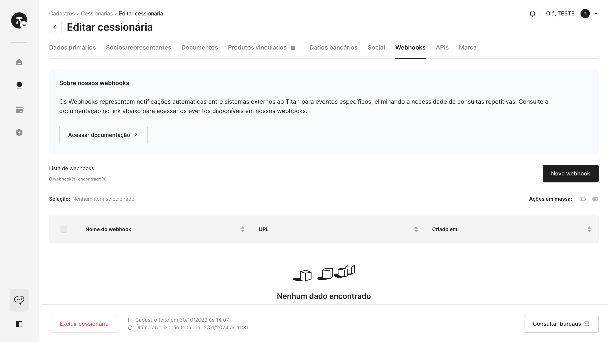
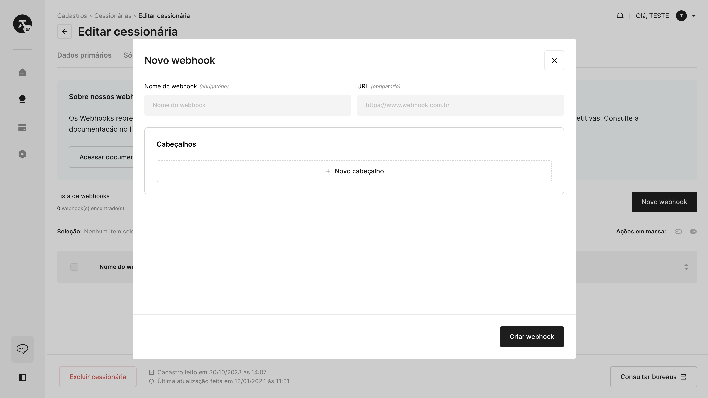
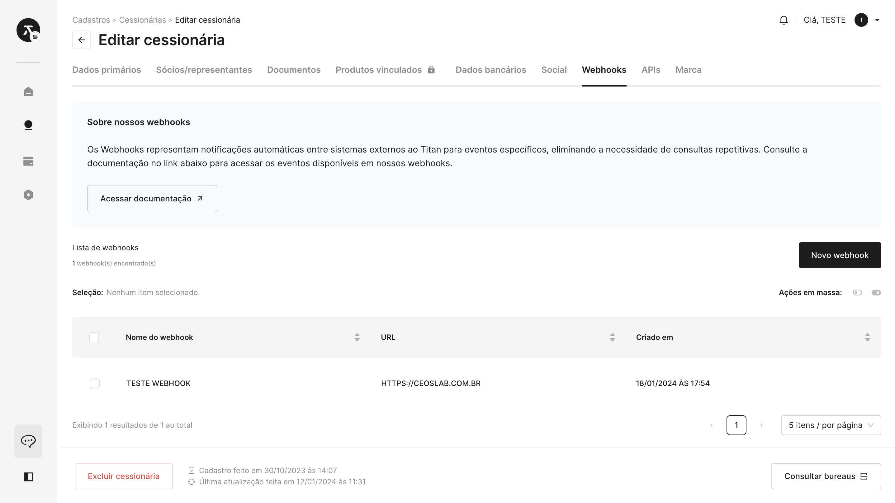

# 📢 Webhook

Esta seção da documentação é dedicada a orientá-lo no processo de integração com **Webhooks** no Titan CaaS. Garantimos que sua experiência seja suave e segura, permitindo que você se concentre na implementação de soluções inovadoras por meio de notificações e comunicações eficientes.

## Como criar um webhook

### Passo 1: Acesse o registro de uma cessionária

Vá para a seção de **"Cadastros"** e selecione **"Cessionárias"**. Em seguida, clique para **"Visualizar"** ou **"Editar"** a cessionária na qual você pretende gerar a chave.

### Passo 2: Navegue até a aba Webhooks

Dentro do registro da cessionária, dirija-se à aba **"Webhooks"** para administrar as credenciais associadas a essa cessionária.

### Passo 3: Crie um novo webhook

Pressione o botão **"Novo webhook"**. Será necessário fornecer um nome para sua credencial e uma URL obrigatoriamente. De forma opcional, você poderá cadastrar cabeçalhos.

Após o preenchimento dos campos obrigatórios, clique em **"Criar webhook"**.

### Passo 4: Exibição

Sua credencial já foi criada! Sua listagem irá atualizar e seu novo webhook será exibido.

